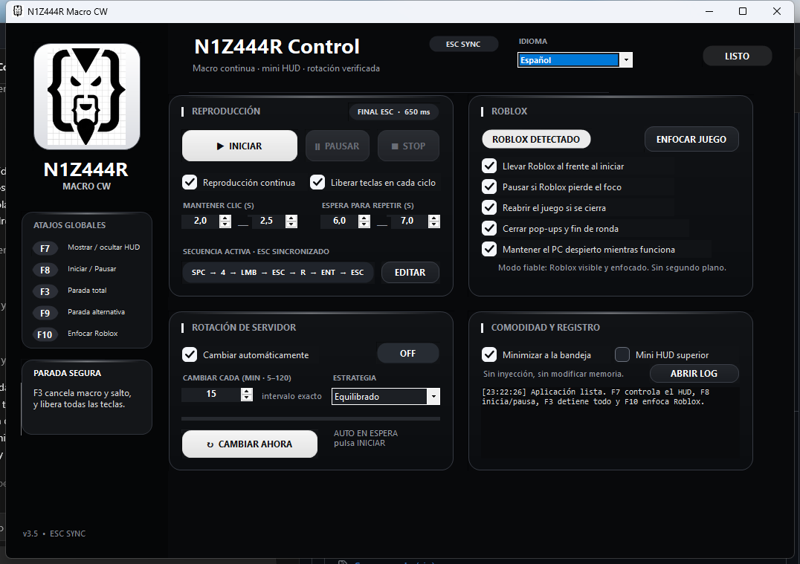
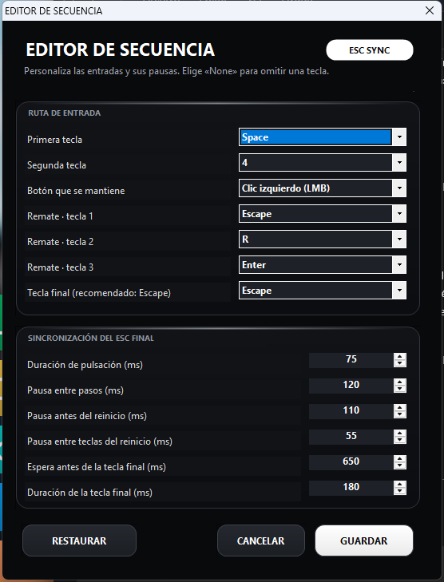

# N1Z444R Macro CW v3.5

Native, configurable input automation for Combat Warriors with continuous playback, a compact HUD, popup recovery, and optional server rotation.

## Default sequence

`SPACE → 4 → hold LMB for 2.0–2.5 s → ESC → R → ENTER → ESC → wait 6–7 s → repeat`

The reset stage uses separate taps. Every key is released before the next key is pressed. The last `ESC` now waits for the confirmation transition, reacquires Roblox focus if required, and uses its own longer press.

Default final-key synchronization:

- Configured delay after `ENTER`: 650 ms.
- Configured final-key duration: 180 ms.
- Measured Windows events during verification: approximately 0.8 s delay and 0.23 s press.

## Sequence editor

The editor now places every label and input inside its own card. Its columns never overlap, so the protected live window matches the preview.

You can configure:

- Both opening keys.
- The held mouse button.
- All three reset keys.
- The final key.
- Regular key duration and pauses.
- Delay before the final key.
- Final-key press duration.

## Popup recovery

Round-end and central popups now use a verified hover transition before clicking. The pointer moves inside the detected button and performs a deliberate press, with a second input method available for retries.

## Controls

- `F7`: show or hide the mini HUD.
- `F8`: start or pause.
- `F3`: emergency stop and release every active input.
- `F9`: alternate emergency stop.
- `F10`: focus Roblox.

## Safety and distribution

This build does not inject into Roblox or edit game memory; it sends local keyboard and mouse input. Automation may be restricted by Roblox or game rules. Use it at your own risk and respect the applicable terms.

Only the protected compiled distribution is published. Source files, protection projects, symbol maps, and build scripts are not included.

No obfuscation can guarantee that software is impossible to analyze. Verify the SHA-256 digest before running the executable.
