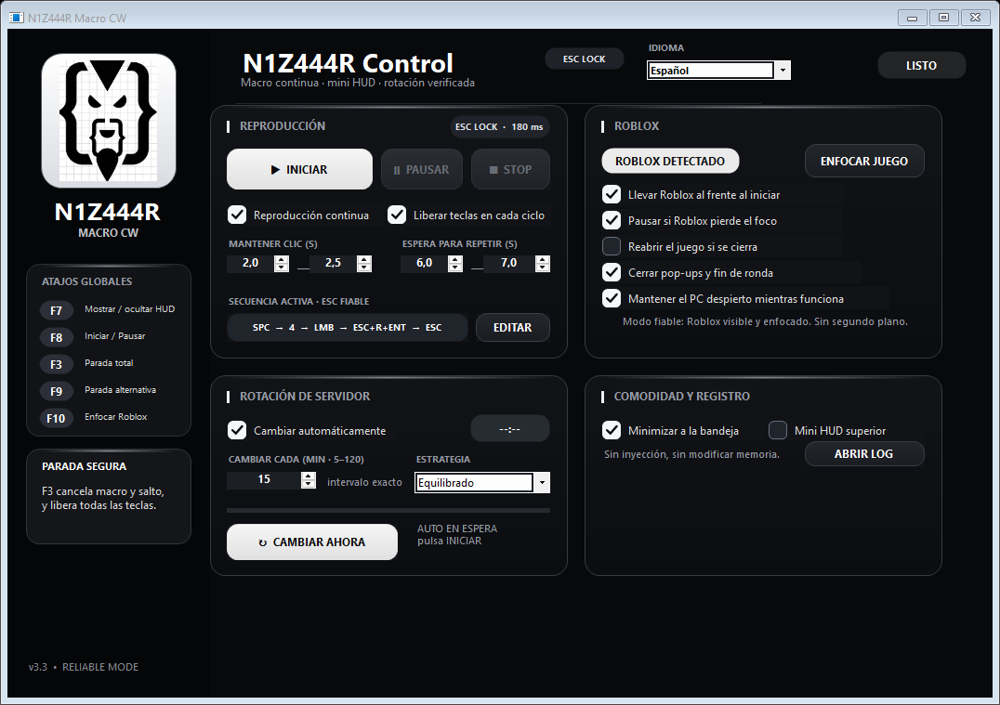
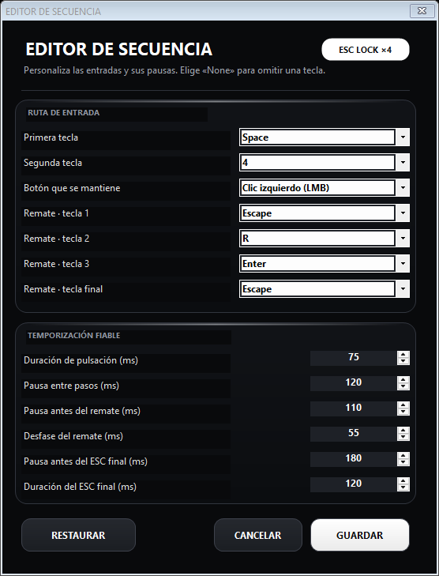

# N1Z444R Macro CW v3.3

Native, configurable input automation for Combat Warriors with continuous playback, a compact HUD, popup recovery, and optional server rotation.

## Default sequence

`SPACE → 4 → hold LMB for 2.0–2.5 s → ESC + R + ENTER → ESC → wait 6–7 s → repeat`

The first `ESC + R + ENTER` group is a fast overlapping chord. The last `ESC` is a separate input: every chord key is released, a configurable reliability delay is applied, and then `ESC` is held for its own configurable duration.

Default reliability timing:

- Delay before the last `ESC`: 180 ms.
- Last `ESC` press duration: 120 ms.
- Older saved configurations are automatically migrated so the fourth key is `ESC`, not `Enter`.

## Sequence editor

The editor lets you change:

- Both opening keys.
- The held mouse button.
- All four finishing keys.
- Regular key press duration.
- Pause between steps.
- Pause before the finishing chord.
- Chord overlap speed.
- Delay before the fourth key.
- Fourth-key press duration.

## Controls

- `F7`: show or hide the mini HUD.
- `F8`: start or pause.
- `F3`: emergency stop and release every active input.
- `F9`: alternate emergency stop.
- `F10`: focus Roblox.

## Safety and distribution

This build does not inject into Roblox or edit game memory; it sends local keyboard and mouse input. Automation may be restricted by Roblox or game rules. Use it at your own risk and respect the applicable terms.

Only the protected compiled distribution is published. Source files, protection projects, symbol maps, and build scripts are not included.

No obfuscation can guarantee that software is impossible to analyze. Verify the SHA-256 digest before running the executable.

