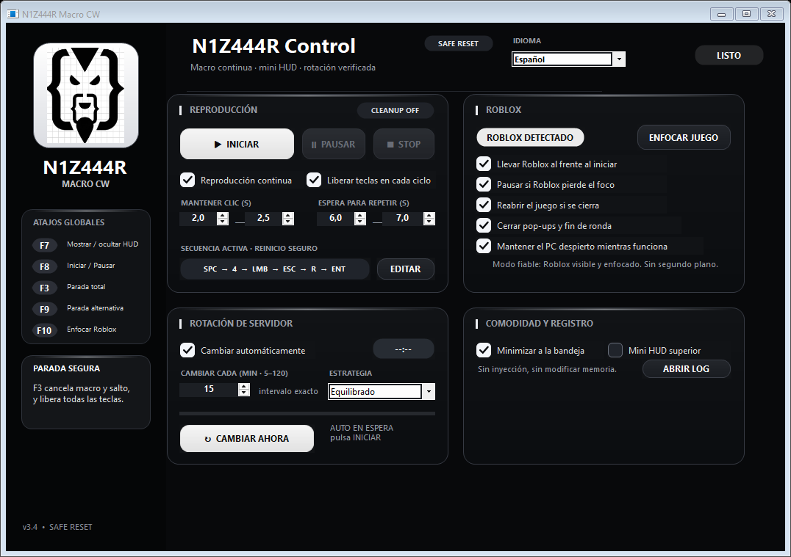
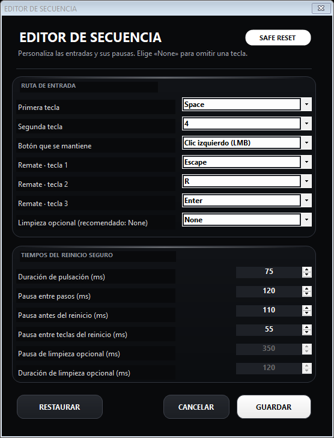

# N1Z444R Macro CW v3.4

Native, configurable input automation for Combat Warriors with continuous playback, a compact HUD, popup recovery, and optional server rotation.

## Safe default sequence

`SPACE → 4 → hold LMB for 2.0–2.5 s → ESC → R → ENTER → wait 6–7 s → repeat`

Version 3.4 sends the reset inputs as rapid **sequential taps**. Every key is released before the next key is pressed. The previous mandatory second `ESC` has been removed because it could reopen the Roblox menu after the reset and break the following cycle.

An optional cleanup key remains available in the sequence editor, but its safe default is `None`.

## Sequence editor

The editor lets you change:

- Both opening keys.
- The held mouse button.
- The three reset keys.
- An optional cleanup key.
- Regular key press duration.
- Pause between steps.
- Pause before reset.
- Pause between reset taps.
- Optional cleanup delay and press duration.

Saved settings from older versions are migrated to the new safe sequence. Review the sequence editor once after upgrading.

## Controls

- `F7`: show or hide the mini HUD.
- `F8`: start or pause.
- `F3`: emergency stop and release every active input.
- `F9`: alternate emergency stop.
- `F10`: focus Roblox.

## Safety and distribution

This build does not inject into Roblox or edit game memory; it sends local keyboard and mouse input. Automation may be restricted by Roblox or game rules. Use it at your own risk and respect the applicable terms.

Only the protected compiled distribution is published. Source files, protection projects, symbol maps, and build scripts are not included.

No obfuscation can guarantee that software is impossible to analyze. Verify the SHA-256 digest before running the executable.
