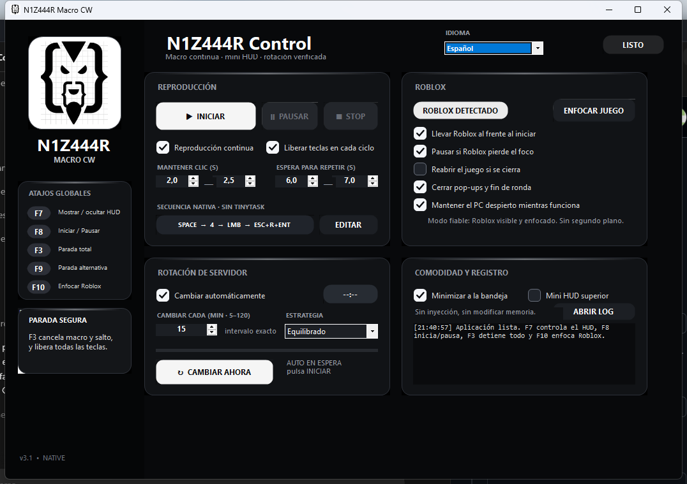
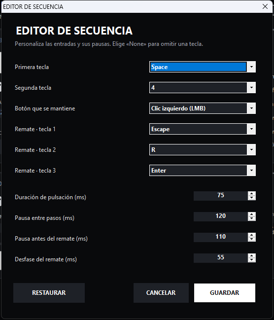

# N1Z444R Macro CW

Macro nativa configurable para Combat Warriors con reproducción continua,
protección contra interrupciones, mini HUD y rotación opcional de servidor.



## Secuencia v3.1

`ESPACIO → 4 → mantener clic izquierdo → ESC + R + ENTER → esperar → repetir`

Valores predeterminados:

- Clic mantenido entre 2,0 y 2,5 segundos.
- Espera entre 6,0 y 7,0 segundos antes de repetir.
- `Esc`, `R` y `Enter` se pulsan con un solape rápido.

## Editor de secuencia



El botón **EDITAR** permite cambiar:

- Las dos teclas iniciales.
- El botón mantenido: izquierdo, derecho o central.
- Las tres teclas del remate.
- Duración de cada pulsación.
- Pausa entre pasos y antes del remate.
- Velocidad con la que se solapan las teclas finales.

Se puede elegir `None` para omitir cualquier tecla.

## Descargar

[N1Z444R_Macro_CW_v3.1_PROTECTED.exe](N1Z444R_Macro_CW_v3.1_PROTECTED.exe)

SHA-256:

```text
BCEC5DCF372BBD49437E8B6F6DC5590782623A10BAAD16C29F0F5FD259D10F7C
```

## Atajos

- `F7`: mostrar u ocultar el mini HUD.
- `F8`: iniciar o pausar.
- `F3`: parada total y liberación de todas las entradas.
- `F9`: parada total alternativa.
- `F10`: enfocar Roblox.

## Protección

Este repositorio contiene únicamente la distribución compilada. No se publican
el código fuente, el proyecto de ofuscación ni mapas de símbolos. El ejecutable
incluye renombrado, cifrado de constantes y recursos, flujo de control protegido,
anti-debug, anti-dump y anti-tamper.

Ninguna ofuscación puede garantizar que un programa sea imposible de analizar.
Verifica siempre el hash antes de ejecutarlo.

## Aviso

No modifica ni inyecta código en Roblox; automatiza entradas locales de teclado
y ratón. La automatización puede estar limitada por las reglas de Roblox o del
juego. Úsala bajo tu responsabilidad y respeta sus términos.

Copyright © 2026 N1Z444R. Todos los derechos reservados.

