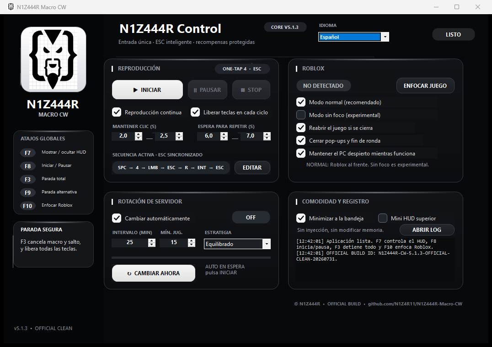

# N1Z444R Macro CW v5.1.3 — Official Clean Build

Official Windows distribution by **N1Z444R** for Combat Warriors.

> **Download only from the named assets on the [latest release](https://github.com/N1Z4R11/N1Z444R-Macro-CW/releases/latest).** Do not use old executables or GitHub-generated source archives as installers.

## Official files

- `N1Z444R_Macro_CW_v5.1.3_OFFICIAL.exe`
- `N1Z444R_Macro_CW_v5.1.3_OFFICIAL_CLEAN.zip`

The official ZIP contains one current executable plus README, license, security notice, and SHA-256 manifest. Legacy executables are no longer stored on the main branch.

## Default sequence

`SPACE → 4 → hold LMB for 2.0–2.5 s → ESC → R → ENTER → ESC → wait 6–7 s → repeat`

## Current features

- Normal foreground mode enabled by default.
- Optional experimental no-focus mode.
- Center Lock prevents accidental clicks away from the middle of Roblox.
- Friends Online, Daily Spins, Round Ended, and central popup recovery.
- Smart final ESC verification.
- F3 total stop releases keys, mouse buttons, and cursor confinement.
- Configurable timings, mini HUD, and verified server rotation.
- Permanent `© N1Z444R • OFFICIAL BUILD` watermark and official build ID.

## Authenticity

- Version: `5.1.3.0`
- Build ID: `N1Z444R-CW-5.1.3-OFFICIAL-CLEAN-20260731`
- Publisher metadata: `N1Z444R`
- SHA-256: `27504918C14CE164C5E0C64065A43B65C9D22580AF878B7AE8EF17F867A88EC5`

## Security

V5.1.3 was rebuilt without the aggressive anti-tamper/obfuscation layer used by legacy protected builds. That layer caused heuristic antivirus detections and made legitimate behavior look suspicious.

The application does not inject into Roblox, modify Roblox memory, bypass anti-cheat systems, install a service, create persistence, upload screenshots, or transmit keyboard input. See [SECURITY.md](SECURITY.md) for an API-by-API explanation.

The executable is not Authenticode-signed because no trusted code-signing certificate is currently available. Windows may therefore display **Unknown publisher** or a SmartScreen reputation warning. Never disable antivirus protection and never restore quarantined legacy builds.

## Controls

- `F8`: start or pause.
- `F3`: total stop.
- `F7`: show or hide the mini HUD.
- `F10`: focus Roblox.

Use automation responsibly and respect Roblox and game rules.
